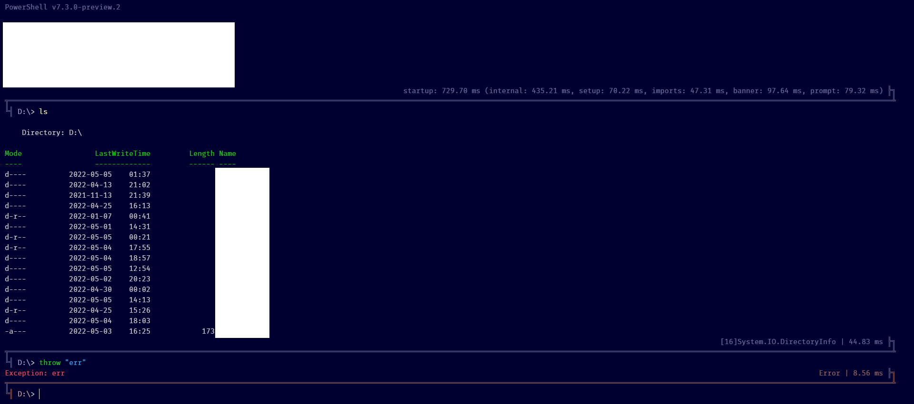

# powershell-profile
My heavily customized Powershell 7 profile directory. Primarily developed for Windows, but my colleague also uses it on Linux and it seems to work. Currently requires at least `PowerShell v7.3.0-preview.2`.



## Installation

First, install a [Nerd font](https://github.com/ryanoasis/nerd-fonts), which is necessary to correctly render the pretty boxes on the right side of the prompt. I personally use a [patched Fira Code](https://github.com/ryanoasis/nerd-fonts/tree/master/patched-fonts/FiraCode/Regular). If you want completions for common native commands, install [Carapace](https://github.com/carapace-sh/carapace-bin) and make sure `carapace` is available on `PATH`.

### Install directly to the PowerShell profile directory

```powershell
# clone this repository and initialize submodules
$ConfigDir = Split-Path $PROFILE
git clone --recursive https://github.com/MatejKafka/powershell-profile $ConfigDir
cd $ConfigDir

# if you want more autocompletions, also install these modules
Install-Module PSGitCompletions
Install-Module WSLTabCompletion
```

### Install to a custom directory

```powershell
# clone this repository wherever you prefer, including submodules
git clone --recursive https://github.com/MatejKafka/powershell-profile
cd powershell-profile

# symlink the main profile from $PROFILE (default profile file path)
New-Item -Type SymbolicLink $PROFILE -Target (Resolve-Path ./Microsoft.PowerShell_profile.ps1)

# if you want more autocompletions, also install these modules
Install-Module PSGitCompletions
Install-Module WSLTabCompletion
```

## Setup (issues)

### Nothing loads?

If you're not running in Windows Terminal, nothing will be loaded. I have it setup this way to make PowerShell load faster when invoked inside an IDE or from a script that does not specify the `-noprofile` PowerShell option. If you want to always load the profile, open `.\Microsoft.PowerShell_profile.ps1` in a text editor and remove the `if` condition around the line where `$PSScriptRoot\profile_full` is imported.

### Some error is thrown from `Set-PSDataRoot` during startup?

This function is called in `profile_full.psm1`. Over time, I wrote multiple custom PowerShell modules that needed to store data somewhere (RSS feeds, TODO,...). To make this data directory configurable, all these modules get the data path from the custom `PSDirectories` module.

Root directory of the data path is configured by calling `Set-PSDataRoot` during the profile setup. I use the path `$PSScriptRoot\..\data`, which most probably doesn't make sense on any other setup than mine. :) A reasonable better choice might be:

- Windows: `$env:APPDATA\powershell-profile`
- Linux: `~/.local/share/powershell-profile`

Note that as a safeguard, you must create the directory manually. This is the default so that the directory isn't accidentally created in the wrong (default) spot.

### How do I change the color scheme?

Modify the color scheme file `PromptColorScheme.psd1` in the data directory (see the previous issue about `Set-PSDataRoot` to know where to look).

### `Ctrl-d` does not work as EOF?

I'm a Windows guy, so I don't need `Ctrl-d`, and I'm using it to open `FSNav` (see below) instead. If you don't like that, change the key-binding in `Prompt/FSNav.psm1`.

### Wow, the startup is slow!

Sorry, I spent quite a lot of time on optimizing it, but yeah, it's an order of magnitude slower than other shells, and quite a major part is the startup time of PowerShell itself, before my profile is even loaded. Hopefully the features will make it worth it for you.

## Module description

### `CustomModules/`

Directory of custom modules, either written by me, or copied from the internet (source is noted in manifest file where applicable). For most of them, just read through the source (they're typically not large modules), few of the more interesting modules are described below:

- **PSLiveEdit** – edit any loaded function and immediately reload it by calling `edit <function-name>` (e.g. `edit prompt`)

- **PSFileHandlers** – a module which allows you to configure your preferred browser and terminal/GUI text editor, used by other modules when they need to open a website or a text file (`Open-Url`, `Open-TextFile`)

- **RSS** – basic RSS reader; configure your RSS feed list by calling `rss-edit`, then use `rss` or `rss-list` to find what's new and read the articles

- **Write-HostColor** – Write-Host with full RGB colors in multiple formats

### `UnmaintainedModules/`

Modules which I once wrote (or copied), but I don't actively use them anymore, or they're under development and not working reasonably well yet. Some of them may work OK, other not so much.

### `Microsoft.PowerShell_profile.ps1`

Base profile script, loaded by PowerShell on startup. I have it symlinked from the default `Documents\Powershell\Microsoft.PowerShell_profile.ps1` path. Checks if we're running in Windows Terminal (or Linux/MacOS), and imports the main profile module.

### `profile_full.psm1`

Main profile module, imported from the previous script. Sets sane defaults for error handling, sets up some data and module paths and imports other parts of the profile, most notably the custom prompt and custom functions.

### `Prompt/Prompt.psm1`

Custom PowerShell prompt, showing last command run time, its return type (currently shows the first one, with item count prepended in case multiple values are returned) and return code (if the command did not finish correctly).

Also shows git status and python virtual environment (activate with `Activate-Venv`, indicator is then added to the prompt; deactivate as usual with `deactivate`).

### `Prompt/FSNav.psm1`

Adds a `Ctrl+d` hotkey that allows you to navigate folders just by typing parts of the desired directory, similar to GUI file managers.
Also adds `Ctrl+UpArrow`, equivalent to `cd ..`.

### `functions.psm1`

Many random useful functions that I use, but are not large enough to warrant a separate module. Read through it, maybe you'll find something useful for you. I'll highlight the `notes` function, which lets you add short notes that are shown at the top of each PowerShell session.
